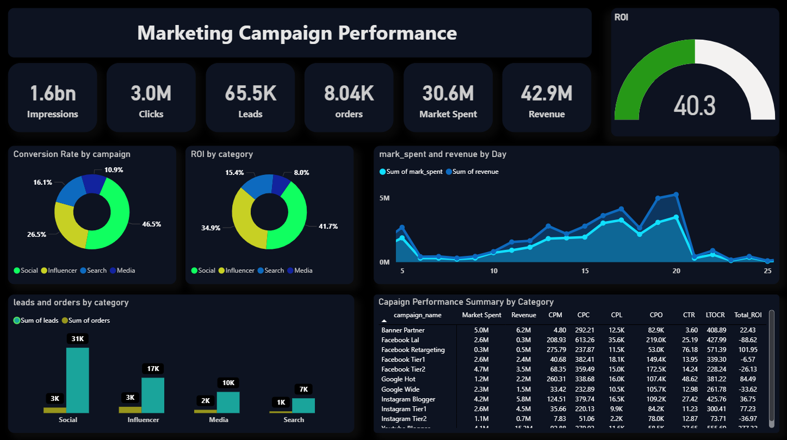

# Marketing Campaign Performance Dashboard – ROI Optimization
---

## Objective
In a complex digital marketing landscape, the primary challenge was linking disparate spending data (Market Spent) to the actual revenue generated (Revenue) to determine which channels were consuming budget without delivering profitable returns.

To engineer a dynamic Power BI dashboard aimed at optimizing budget efficiency by precisely identifying all campaigns with negative ROI and strategically refocusing attention towards the highest-yielding, most profitable channels.

---
## Methodology & Technical Stack
This solution leverages Power BI to deliver advanced marketing analytics, demonstrating proficiency in:
- Advanced DAX Calculations: Building complex financial measures, most notably the Total ROI metric and crucial Conversion Rates (e.g., Lead-to-Order) to ensure financially sound decision-making.
- Multi-Dimensional Analysis: Performing granular performance analysis across Campaign Category and individual Campaign Level to clearly expose "Budget Waste Campaigns."
- Visual Strategy: Implementing a professional Dark Theme with prominently highlighted green indicators for ROI, ensuring immediate focus on positive financial performance.
---
## Key Insights & Actionable Findings
The analysis shifted the focus from merely reporting data to driving immediate, high-impact business decisions:
- Identified Budget Leakage: The dashboard pinpointed three specific sub-campaigns (within Facebook and Instagram) that were consistently generating Negative ROI. This finding presents an immediate opportunity to reallocate a substantial budget amount to more effective channels.
- High-Performance Channels: The visualization confirmed that the Social and Search categories are the primary drivers for leads and orders. 
- Spending Pattern vs. Revenue: Daily trend analysis revealed a direct correlation between increased spending during the 15th to 25th of the month and a significant spike in revenue generation.
---
# Dashboard Features
- KPI Scorecard: Impressions, Clicks, Leads, Orders, Market Spent, Revenue, and the central ROI (Return on Investment).
- Channel Contribution Analysis: Visual comparison of ROI and Conversion Rates across different marketing channels (Social, Search, Media).
- Campaign Performance Table: Detailed breakdown of key metrics (CPM, CPL, CPO, CTR) for every individual campaign.
---
## Dashboard Preview

