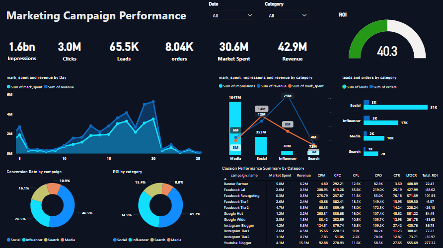

# Marketing Campaign Performance Dashboard

##  Project Overview
This Power BI dashboard provides detailed insights into the performance of marketing campaigns, analyzing key metrics such as impressions, clicks, conversions, cost, revenue, and ROI.

## Objective
- Measure and compare campaign effectiveness
- Identify high-performing and underperforming campaign types
- Track key metrics such as ROI 
- Visualize trends in user engagement and conversion

## Files Included
- `Marketing-Campaign-Dashboard.pbix
- `Marketing-Campaign-Data.csv`

## Tools Used
- Power BI (DAX, Power Query)
- Excel / CSV (as data source)

## Key Dashboard Elements
- **Campaign Performance Summary by Category**
- **Cost vs Revenue per Campaign Type**
- **ROI Comparison by Campaign Type**
- **Campaign Type Distribution**
- **Key Performance Metrics**
- **ROI**
- **Engagement and Conversion Comparison**

## Dashboard Preview

